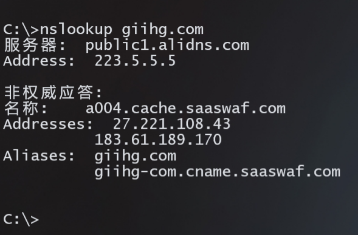
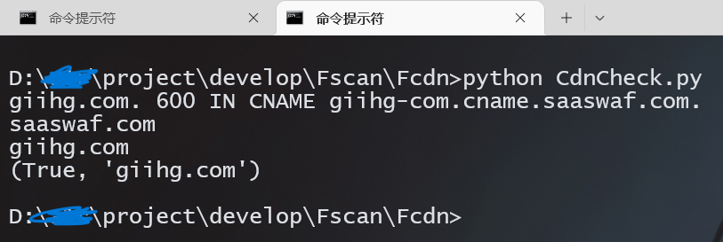
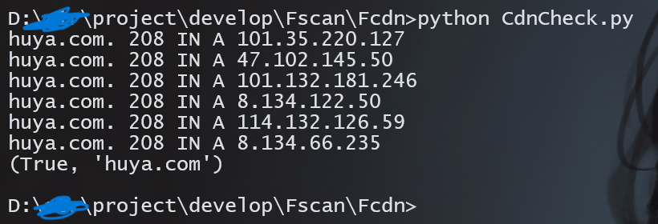

# FCDN 批量检测脚本

更强大的cdn检测，但不止cdn检测。

## 如何使用？

安装依赖：
```
pip install -i https://pypi.tuna.tsinghua.edu.cn/simple -r requirements.txt
```

单个url测试：

```
python cdnCheck.py -u huya.com
```

批量子域名检测：

```
python main.py -f domain.txt -t 100
```

返回的结果在 result 目录下，共有三个：

nocdnResult.txt 
cdnResult.txt
errorResult.txt

## 它可以做什么？

先说优点：**快速**、**精准**、**全面**

功能是从一大堆子域名中查找使用了真实IP的子域名，方便使用者精准定位服务器所在网段

**你可以去对比一下 Oneforall 的cdn识别结果，再来对比该工具的 cdn 识别结果，你会发现 Oneforall 的误报率很高，这就是传统 cdn 检测手段的不足之处。**

支持多线程，但不是太重要，因为它的主要作用不是探测子域名，虽然它也可以做到，但不是最好的，在我看来最好的子域名探测工具是 OneForAll。

比如使用了云waf、cdn、dmzweb 等技术的网站是无法解析真实IP的，而现在大量的网站使用了云waf，这时候我们的技术手段不应停留在单纯的检测cdn上，这是不准确不充分不完整的，所以有了这个工具。

## 为什么重要？

因为如果能快速准确的识别出使用了真实IP的站点，我们就可以精准的去扫该IP段，从而发现更多的资产，避免误伤和浪费时间。

## 检测原理

放弃了传统的检测白名单CDN网段/ASN的方式，因为这种方式需要去维护和更新 cdn 网段，不太可靠。
也不使用第三方的站点来判断。
转而是使用 Python 的 dnspython 库去判断是否存在 CDN，该库的功能相当于使用 nslookup 命令去解析目标站点。

有三种情况下，可以知道目标域名是否使用了真实IP和域名有效性。

1. 返回结果多于两个ip
    [<104.21.23.10>, <172.67.208.68>]
    这种情况，目标站点一定是使用了cdn服务

2. 返回结果里面 nameserver 的主域名不是检测的host的主域名
    比如：www.abc.com 的 CNAME 是 www-abc-com.site.nscloudwaf.com 
    出现这种情况是因为目标站点使用了云 waf，这种站点也是获取不到真实IP的。

3. 使用了dmzweb技术防护的站点，统一把网站的流量导向该站点 dmzweb.xxx.edu.cn,无法获取真实IP，对比扫描的domain长度和解析的cname长度。

你可能会遇到使用了负载均衡技术的站点，这时候使用第三方站点测试，会检测到多个解析的IP，但那些 IP 都是目标的用来做负载均衡的 IP 资产，也是属于目标资产，该工具不会将其归类到cdn上，如 [F5 Big-IP](https://baike.baidu.com/item/F5%20BIG-IP%E6%9C%AC%E5%9C%B0%E6%B5%81%E9%87%8F%E7%AE%A1%E7%90%86%E5%99%A8/4415289?fr=aladdin)。

也有些不太寻常的域名，比如 sto.cn，在 nslookup 的解析是

非权威应答:
名称:    sto.cn
Address:  203.107.44.133

多地ping和cdn节点检测都是只有一个IP，但该IP的80端口上绑定了很多不同的站点，这种情况，它就是真实 IP，只是通过 ServerName 区分不同的域名实现绑定多个站点。

这种情况的 IP 是真实但没有意义的，所以直接拉黑了这个 IP，归到使用了 cdn 那一列。

## 测试

在线cdn检测网站 https://myssl.com/cdn_check.html

测试了以下几个站点，返回的结果都不同，精准确认

```
giihg.com				云waf
huya.com				cdn
www.cip.cc				真实IP
xxx.edu.cn				使用了 dmz 服务器，解析到dmz.xxx.edu.cn
www.csu.edu.cn			使用了 F5 Big-IP 负载均衡
```

部分测试结果



脚本测试结果：





脚本测试的结果是否准确：

type .\result\errorResult.txt | nslookup

## 看到最后

虽然这个项目挺简单的，挺小的一件事，但能从一大堆子域名中快速找到可能使用了真实 IP 的子域名，这又何尝不是把一件小事做到极致。

也许某一天，这个工具会在我一筹莫展的时候给我带来一点惊喜，我想这就是它存在的意义了吧。

工作之余开发，如有错漏，请提到 issues。

如果该项目对你有帮助，麻烦点个 star，万分感谢。

## 免责声明

```
本工具仅面向合法授权的企业安全建设行为，在使用本工具进行检测时，您应确保该行为符合当地的法律法规，并且已经取得了足够的授权。  
如您在使用本工具的过程中存在任何非法行为，您需自行承担相应后果，我们将不承担任何法律及连带责任。 
在使用本工具前，请您务必审慎阅读、充分理解各条款内容，限制、免责条款或者其他涉及您重大权益的条款可能会以加粗、加下划线等形式提示您重点注意。 除非您已充分阅读、完全理解并接受本协议所有条款，否则，请您不要使用本工具。
您的使用行为或者您以其他任何明示或者默示方式表示接受本协议的，即视为您已阅读并同意本协议的约束。 
```
